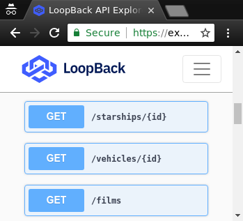

# swoopi

[swoopi](https://swoopi-brgsggcqrg.now.sh/) lives here!

swoopi is the freshest [SWAPI](https://swapi.co/about) and
[loopback](https://github.com/strongloop/loopback-next) API!

# why
are you kidding me? it's a Star Wars API. using the
latest greatest loopback. what more could you ask for?

# how do I...
1. clone it `git clone the https://github.com/profbear/swoopi.git`
1. install deps `cd swoopi ; npm i`
1. start it  `npm start` boots a URL like [localhost:3000](http://localhost:3000)
1. skim it in the browser at [localhost:3000](http://localhost:3000)
1. explore the depths at [localhost:3000/explorer](http://localhost:3000/explorer)

it'll kinda look like this publicly available
[swoopi](https://swoopi-brgsggcqrg.now.sh/).  

# where data from
swoopi is a
[service proxy](https://loopback.io/doc/en/lb4/Testing-your-application.html#obtain-a-service-proxy-instance)
to the world's first machine-readable set of Star Wars data
at [swapi.co](https://swapi.co/about).

now that the SWAPI is modelled with OpenAPIv3, and because
it uses loopback, you get the all the massive, cool, crazy
enterprise-grade benefits.

## but the rate limit
[please don't be that guy](https://swapi.co/documentation#rate);
you're limited to 10,000 API calls per day

# what next
make a GUI, make an app, make some
[bitch lasagna](https://www.youtube.com/watch?v=6Dh-RL__uN4).

# bugs in SWAPI
these are not swoopi bugs, but I don't know how to
get ahold of the homeboy who wrote SWAPI. so, they remain bugs:
- created, edited, and url `/schema $.description`s don't 
  matchup across all models
- Species and Vehicle have the wrong `/schema $.title`

> Copyright (c) 2018 Unbearable Professional
> 
> This is free and unencumbered software released into the public domain.
> 
> Anyone is free to copy, modify, publish, use, compile, sell, or
> distribute this software, either in source code form or as a compiled
> binary, for any purpose, commercial or non-commercial, and by any
> means.
> 
> In jurisdictions that recognize copyright laws, the author or authors
> of this software dedicate any and all copyright interest in the
> software to the public domain. We make this dedication for the benefit
> of the public at large and to the detriment of our heirs and
> successors. We intend this dedication to be an overt act of
> relinquishment in perpetuity of all present and future rights to this
> software under copyright law.
> 
> THE SOFTWARE IS PROVIDED "AS IS", WITHOUT WARRANTY OF ANY KIND,
> EXPRESS OR IMPLIED, INCLUDING BUT NOT LIMITED TO THE WARRANTIES OF
> MERCHANTABILITY, FITNESS FOR A PARTICULAR PURPOSE AND NONINFRINGEMENT.
> IN NO EVENT SHALL THE AUTHORS BE LIABLE FOR ANY CLAIM, DAMAGES OR
> OTHER LIABILITY, WHETHER IN AN ACTION OF CONTRACT, TORT OR OTHERWISE,
> ARISING FROM, OUT OF OR IN CONNECTION WITH THE SOFTWARE OR THE USE OR
> OTHER DEALINGS IN THE SOFTWARE.
> 
> For more information, please refer to http://unlicense.org/
